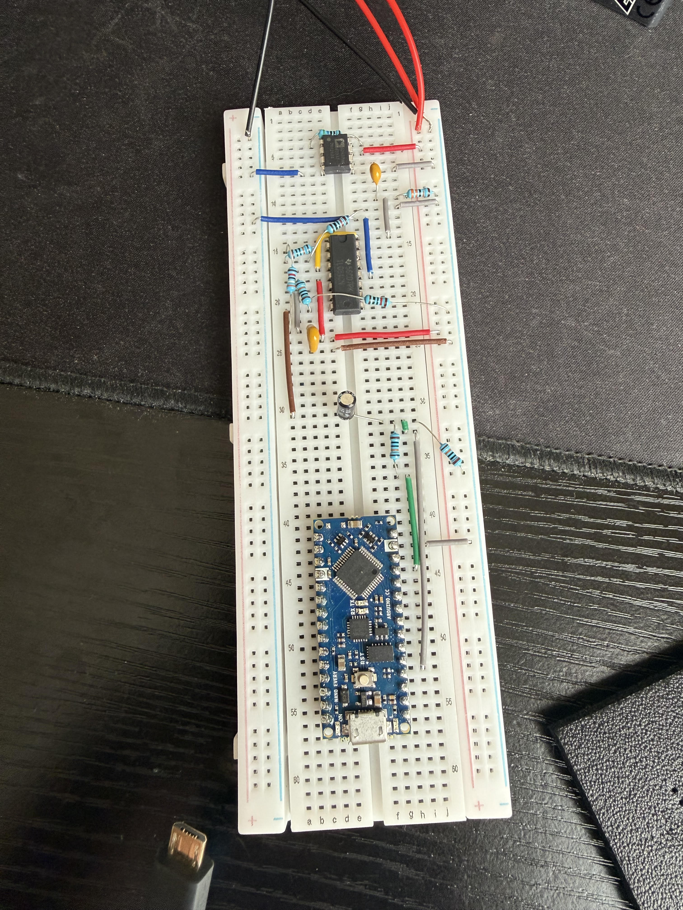
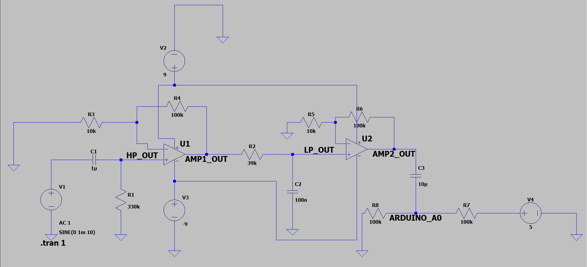
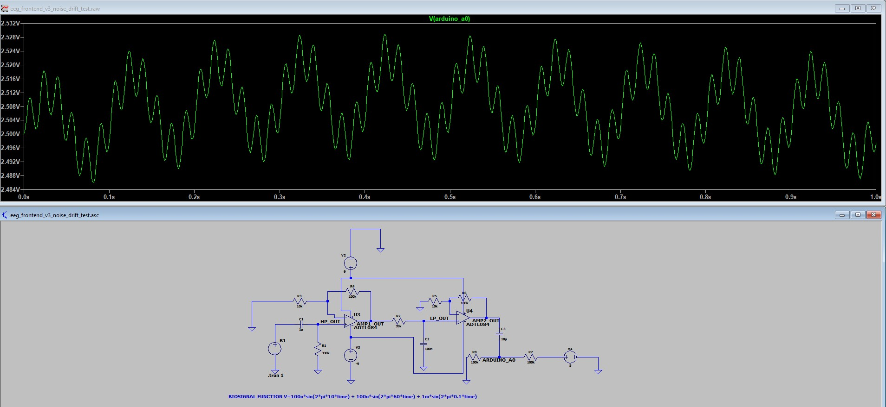

# Low-Cost Electrophysiology Acquisition System

A personal engineering project building a reproducible, low-cost bio-signal acquisition pipeline from bare analog front-end hardware to digital neural data analysis.

## Project Goal

Develop a low-cost, full-stack system for collecting and analyzing electrophysiological biosignals (ECG/EEG) using off-the-shelf components. This project bridges analog signal conditioning, microcontroller-based digital telemetry, and Python-based signal processing to successfully extract and analyze microvolt-level biological signals. 

This project is for learning, prototyping, and non-medical experimentation only.

## Current Progress & Milestones Achieved

### 1. Analog Front-End Hardware (Completed)
- Designed and simulated a full analog signal chain in LTspice using an AD620ANZ instrumentation amplifier and TL084 op-amp gain stages.
- Successfully built the physical circuit on a breadboard, implementing an RC high-pass filter for low-frequency drift reduction and an RC low-pass filter ($f_c \approx 40.8\text{ Hz}$) to attenuate 60Hz interference.
- Engineered a stable 2.4V DC bias to safely couple the alternating biological current into the Arduino's 0-5V digital domain.

### 2. Digital Telemetry & Data Acquisition (Completed)
- Established a real-time serial communication bridge using an Arduino Nano Every.
- Wrote a Python collection script utilizing `pyserial` to capture the 10-bit ADC byte stream at a 200Hz sampling rate and log the raw telemetry to a local CSV.

### 3. Signal Processing & Algorithm Validation (Completed)
- Ingested the raw hardware array into `mne-python` (a clinical-grade neurophysiology library).
- Applied a 1Hz to 40Hz digital bandpass filter to eliminate residual DC baseline wander and high-frequency breadboard noise.
- Engineered and debugged an automated peak-detection algorithm using `scipy.signal.find_peaks`, utilizing minimum-voltage thresholds to prevent false-positive wave detection and extract a resting heart rate.

## Results & Signal Processing

The system was physically validated using a Lead I ECG placement (gold-plated cup electrodes and Ten20 conductive paste). The pipeline successfully isolated the raw QRS complex from the physical noise floor.



*The physical analog amplification and filtering chain bridged to the Arduino 10-bit ADC.*


*The raw analog data processed through MNE-Python. A 1Hz-40Hz digital bandpass filter successfully eliminates baseline wander and residual high-frequency artifacts.*


*Algorithmic validation using SciPy. A strict amplitude threshold and distance parameter were applied, successfully calculating an accurate resting state of 67.1 BPM.*

## Simulation Gallery

LTspice schematic design for analog front-end using universal OpAmp.



Transient simulation of an EEG-like input containing a 10 Hz signal, 60 Hz noise, and slow drift after passing through the analog front-end. The output remains centered around the Arduino ADC bias.




## Repository Structure

```text
ltspice/
  eeg_frontend_v1_ac_analysis.asc
  eeg_frontend_v1_transient.asc

src/
  record_ecg.py
  signal_processing.ipynb

images/
  real_circuit_build.jpg
  mne_filtered_ecg.jpg
  scipy_peak_detection.jpg
  schematics_images/
    LTspice_OpAmp_bandPass.jpg
    ...
```

## Next Steps
- Re-tune the analog gain stages to accommodate microscopic $50\mu\text{V}$ EEG brainwaves.
- Transition electrode placement to the frontal lobe/occipital lobe for Alpha-wave detection experiments.
- Implement real-time Fast Fourier Transform (FFT) analysis to calculate Power Spectral Density (PSD).
