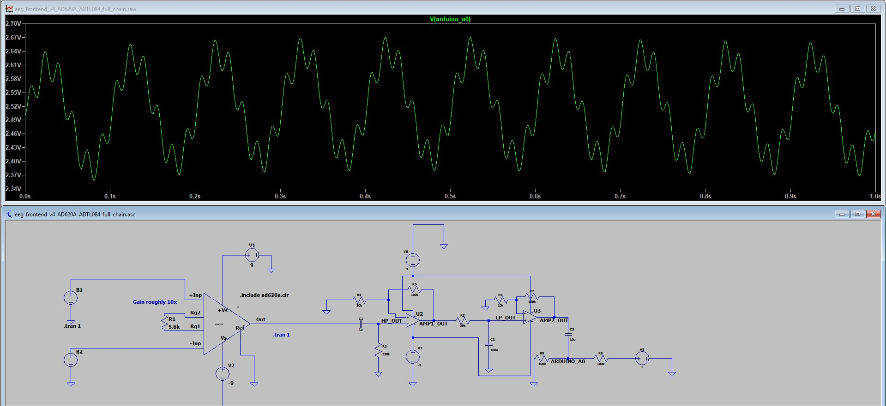

# Low-Cost EEG Signal Acquisition System

A personal project building a reproducible, low-cost EEG acquisition pipeline from analog front-end hardware to eventual neural data analysis.

## Project Goal

Develop a low-cost system for collecting and analyzing EEG-style biosignals using off-the-shelf components. The long-term goal is to combine analog signal conditioning, Arduino-based data capture, and Python-based signal processing for exploratory neuroscience and neurofeedback experiments.

This project is for learning, prototyping, and non-medical experimentation only.


## Current Progress

### Analog Front-End Design 

- Created an early analog front-end prototype in Tinkercad to model signal conditioning, amplification, filtering, and Arduino-compatible 2.5V biasing
- Rebuilt the core front-end architecture in LTspice for more rigorous circuit simulation
- Designed and simulated a full EEG-style signal chain consisting of:
  - Differential EEG-like input modeled with an AD620A instrumentation amplifier
  - Series current-limiting resistors and 5.1V zener clamps for input protection
  - RC high-pass filtering for low-frequency drift reduction
  - ADTL084 op-amp gain stages for additional amplification
  - RC low-pass filtering for high-frequency attenuation
  - AC coupling into a 2.5V Arduino-compatible ADC bias node
- Verified input protection behavior by confirming the zener clamps remain inactive during normal EEG-like signals and activate during large input stress tests
- Verified circuit behavior using AC analysis for frequency response and transient analysis for time-domain waveform behavior
- Replaced the ideal op-amp model with LTspice’s ADTL084 model as a more realistic TL084-family approximation
- Tested the full chain using low-amplitude differential inputs, including clean sine waves and EEG-like signals with 10 Hz content, 60 Hz noise, and low-frequency baseline drift
- Verified that the final Arduino ADC node remains centered near 2.5V while preserving the amplified signal and showing remaining noise/artifact components
- Current LTspice version uses an approximate ~0.5 Hz to ~40 Hz bandpass, with gain distributed across the AD620A input stage and ADTL084 amplification stages


### Hardware 
- Completed hand-drawn schematic planning
- Sourced major components for breadboard-level testing
- Tested basic Arduino Nano Every setup and simple breadboard circuits
- Planning physical signal-chain testing with known test signals before connecting electrodes

### Software
- Tested basic Arduino serial communication
- Planned Python pipeline for:
  - Serial data reading
  - Signal visualization
  - Digital filtering
  - FFT analysis
  - Feature extraction

## Gallery


*First-hand-drawn schematic for basic analog front-end design*


*LTspice schematic design for analog front-end using universal OpAmp*


*LTspice schematic design for analog front-end using ADTL084 OpAmp (higher-precision and accuracy than traditional TL084). Also includes output behavior with 10microvolt input*


*Transient simulation of an EEG-like input containing a 10 Hz signal, 60 Hz noise, and slow drift after passing through the analog front-end. The output remains centered around the 2.5V Arduino ADC bias.*



*Transient simulation of the full EEG-like front-end using a differential input with 10 Hz signal content, 60 Hz noise, and baseline drift into AD620A. The final output remains centered near the 2.5V Arduino ADC bias after instrumentation amplification, filtering, and op-amp gain stages.*

## Repository Structure

```text
ltspice/
  eeg_frontend_v1_ac_analysis.asc
  eeg_frontend_v1_transient.asc

images/
  schematics_images/
    LTspice_OpAmp_bandPass.jpg
    ...
  parts/
    OpAmps.jpg
    ...
  breadboard_work/
    LED_voltage_test.jpg
    ...
    
```

## Next Steps
- Convert the LTspice simulation into a clean breadboard build schematic with IC pin numbers, rails, component values, and Arduino connections
- Compare simulated behavior against physical breadboard tests using known test signals before connecting electrodes
- Build and test the analog front-end in isolated, battery-powered conditions
- Implement Arduino-based real-time data collection from the biased analog output
- Develop a Python analysis pipeline for serial reading, visualization, digital filtering, FFT analysis, and feature extraction
- Document limitations, safety considerations, and differences between simulation and physical hardware

## Tech Stack
- Hardware: Gold-plated electrodes, Arduino Nano Every, AD620ANZ instrumentation amplifier, TL084CN op-amps, resistors, capacitors, trimpot, Zener diodes
- Simulation/Design: Tinkercad, LTspice
- Planned Analysis: Python, NumPy, SciPy, Matplotlib

