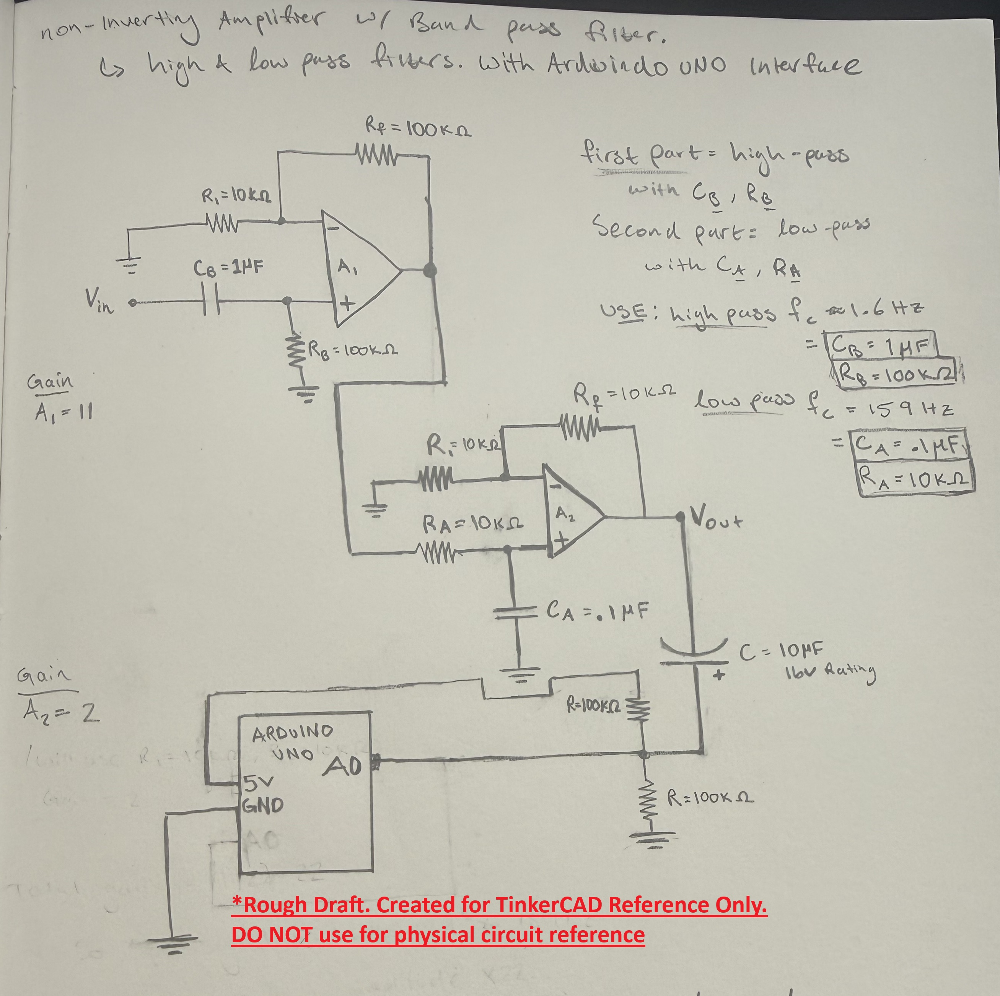
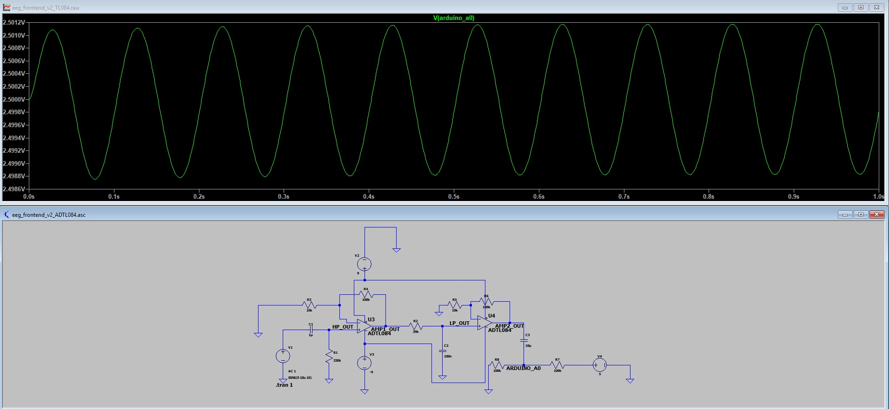

# Low-Cost EEG Signal Acquisition System

A personal project building a reproducible, low-cost EEG acquisition pipeline from analog front-end hardware to eventual neural data analysis.

## Project Goal

Develop a low-cost system for collecting and analyzing EEG-style biosignals using off-the-shelf components. The long-term goal is to combine analog signal conditioning, Arduino-based data capture, and Python-based signal processing for exploratory neuroscience and neurofeedback experiments.

This project is for learning, prototyping, and non-medical experimentation only.


## Current Progress

### Analog Front-End Design 
- Created an early analog front-end prototype in Tinkercad to model signal conditioning, amplification, filtering, and Arduino-compatible 2.5V biasing
- Rebuilt the core front-end architecture in LTspice for more rigorous circuit simulation
- Designed and simulated a signal chain consisting of:
  - RC high-pass filtering for low-frequency drift reduction
  - Two non-inverting op-amp gain stages
  - RC low-pass filtering for high-frequency attenuation
  - AC coupling into a 2.5V Arduino-compatible bias node
- Verified circuit behavior using:
  - AC analysis to inspect frequency response and gain
  - Transient analysis to test sine-wave inputs at different frequencies
- Replaced the ideal op-amp model with LTspice’s ADTL084 model as a more realistic TL084-family approximation
- Verified predictable gain behavior across 1mV, 100µV, 50µV, and 10µV test inputs
- Simulated more realistic EEG-like input conditions by combining a 10 Hz signal with 60 Hz noise and low-frequency baseline drift
- Verified that the final Arduino ADC node remains centered near 2.5V while preserving the amplified signal and showing remaining noise/artifact components
- Current LTspice version uses an approximate passband of ~0.5 Hz to ~40 Hz with total simulated gain of approximately 121x

### Hardware 
- Completed hand-drawn schematic planning
- Sourced major components for breadboard-level testing
- Tested basic Arduino Nano Every setup and simple breadboard circuits
- Planning physical signal-chain testing with known test signals before connecting electrodes

### Software
- Tested basic Arduino serial communication
- Planned Python pipeline for:
  - Serial data reading
  - Signal visualization
  - Digital filtering
  - FFT analysis
  - Feature extraction

## Gallery



*First-hand-drawn schematic for basic analog front-end design*


*LTspice schematic design for analog front-end using universal OpAmp*



*LTspice schematic design for analog front-end using ADTL084 OpAmp (higher-precision and accuracy than traditional TL084)*


*Transient simulation of an EEG-like input containing a 10 Hz signal, 60 Hz noise, and slow drift after passing through the analog front-end. The output remains centered around the 2.5V Arduino ADC bias.*

## Repository Structure

```text
ltspice/
  eeg_frontend_v1_ac_analysis.asc
  eeg_frontend_v1_transient.asc

images/
  schematics_images/
    LTspice_OpAmp_bandPass.jpg
    ...
  parts/
    OpAmps.jpg
    ...
  breadboard_work/
    LED_voltage_test.jpg
    ...
    
```

## Next Steps

- Compare simulated behavior against physical breadboard tests using known test signals before connecting electrodes
- Build and test the analog front-end in isolated, battery-powered conditions
- Evaluate whether additional gain, stronger filtering, a 60 Hz notch filter, or an external ADC is needed for microvolt-level EEG signals
- Implement Arduino-based real-time data collection from the biased analog output
- Develop a Python analysis pipeline for serial reading, visualization, digital filtering, FFT analysis, and feature extraction
- Document limitations, safety considerations, and differences between simulation and physical hardware

## Tech Stack
- Hardware: Arduino Nano Every, AD620 instrumentation amplifier, TL084CN op-amps, resistors, capacitors, trimpot, electrodes, Zener diodes
- Simulation/Design: Tinkercad, LTspice
- Planned Analysis: Python, NumPy, SciPy, Matplotlib

